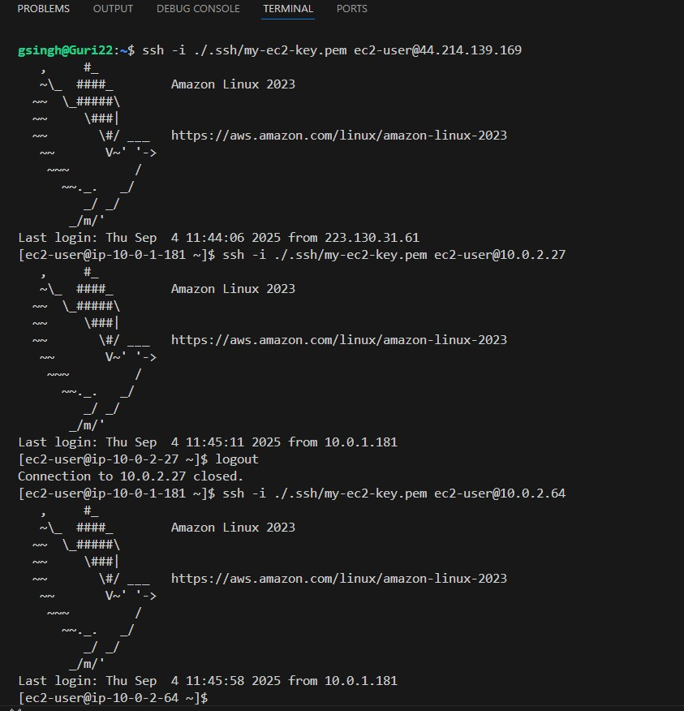

# Terraform Two-Tier Infrastructure: Secure AWS Architecture 🏗️

Welcome to my second Terraform adventure! This project takes infrastructure security to the next level by building a **two-tier architecture** on AWS that mirrors real-world production setups. I've created a secure, isolated environment where a bastion host acts as the gatekeeper to private application servers—exactly how the pros do it.

This was an incredible learning experience that taught me about network isolation, security groups, and the art of building truly secure cloud infrastructure using Infrastructure as Code (IaC).

[](https://developer.hashicorp.com/terraform/docs) [](https://registry.terraform.io/providers/hashicorp/aws/latest)

***

## ✅ What's Inside?

This isn't just another EC2 deployment—it's a production-ready, security-first architecture:

* **🏢 Two-Tier Architecture:** Separates public-facing resources (bastion) from private application servers for maximum security
* **🌐 Custom VPC with Dual Subnets:** Creates a fresh VPC with both public and private subnets, each with proper routing
* **🛡️ Bastion Host Security:** Public subnet bastion that acts as a secure entry point—no direct access to private servers!
* **🔐 Private Application Server:** Backend server isolated in private subnet, accessible only through the bastion
* **🚪 Smart Security Groups:** Bastion only accepts SSH from your IP, private server only accepts SSH from bastion's private IP
* **🔑 Key Pair Authentication:** Secure SSH access using AWS key pairs for both instances
* **📦 Modular Design:** Three separate modules (VPC, bastion, app server) for clean, reusable code
* **⚙️ Configurable Setup:** Easy customization through variables and tfvars files
* **🎯 Production-Ready:** Follows AWS best practices for secure, scalable infrastructure

***

## 📊 Architecture Diagram

<p align="center">
  
</p>

***

## 🛠️ Let's Get This Running

Ready to build some enterprise-grade infrastructure? Here's your step-by-step guide.

### Prerequisites

Make sure you have these essentials ready:
1. **Terraform:** [Install from here](https://learn.hashicorp.com/tutorials/terraform/install-cli) if you haven't already
2. **AWS Account:** With permissions to create VPC, EC2, Security Groups, and Route Tables
3. **AWS CLI Configured:** Run `aws configure` to set up your credentials
4. **SSH Key Pair:** Create an AWS key pair in your target region for secure access

### Step-by-Step Guide

1. **Clone This Project**
   ```bash
   # Clone the repository to your local machine
   git clone <your-repo-url>
   cd Terraform-2tier-Infra
   ```

2. **Configure Your Variables**
   Copy and customize the variables file:
   ```bash
   cp prod.tfvars.example prod.tfvars
   # Edit prod.tfvars with your specific values (key pair name, your IP, etc.)
   ```

3. **Initialize Terraform**
   Download all the necessary providers and modules:
   ```bash
   terraform init
   ```

4. **Plan Your Infrastructure**
   See exactly what Terraform will create:
   ```bash
   terraform plan -var-file="prod.tfvars"
   ```

5. **Deploy the Architecture**
   Build your secure two-tier infrastructure:
   ```bash
   terraform apply -var-file="prod.tfvars"
   ```

6. **Access Your Infrastructure**
   Once deployed, SSH to your bastion host, then hop to the private server:
   ```bash
   # SSH to bastion host (use the public IP from output)
   ssh -i your-key.pem ec2-user@<bastion-public-ip>
   
   # From bastion, SSH to private server (use private IP from output)
   ssh -i your-key.pem ec2-user@<app-server-private-ip>
   ```

<p align="center">
  
</p>


***

## 🤔 My Challenges & Key Takeaways

Building secure infrastructure taught me some valuable lessons. Here are the biggest hurdles I conquered:

### Challenge 1: Public IP Confusion

My biggest facepalm moment! I forgot to set `map_public_ip_on_launch = true` in my public subnet configuration. This meant my bastion host launched without a public IP—completely defeating the purpose of having a bastion!

**The Fix:** I learned two approaches:
1. **Quick Fix:** Use `terraform taint` to recreate the instance
2. **Best Practice:** Attach an Elastic IP for consistent public addressing

```hcl
# Don't forget this crucial setting in your public subnet!
resource "aws_subnet" "public_subnet" {
  vpc_id                  = aws_vpc.main_vpc.id
  cidr_block              = var.public_subnet_cidr
  availability_zone       = data.aws_availability_zones.available.names[0]
  map_public_ip_on_launch = true  # This little line is CRITICAL!
  
  tags = {
    Name = "Public Subnet"
  }
}
```

### Challenge 2: SSH to Private Instances

Initially, I tried to SSH directly from my laptop to the private EC2 instance. Spoiler alert: that's not how private subnets work! 🤦‍♂️

**The Solution:** I discovered the proper "hop" method:
1. Upload your private key to the bastion host
2. SSH through the bastion to reach private instances
3. **Better approach:** Use SSH agent forwarding for security

```bash
# SSH with agent forwarding (more secure)
ssh -A -i your-key.pem ec2-user@<bastion-public-ip>
# Then from bastion:
ssh ec2-user@<private-instance-ip>
```

### Challenge 3: Routing Doubts

I was initially confused about why we'd run HTTP/Nginx on a server that nobody can directly access from the internet. Then it clicked—this is exactly how real production environments work!

**The Revelation:** In production, you'd have:
- Load balancers in public subnets
- Application servers in private subnets
- Database servers in even more isolated subnets

This project perfectly mimics that real-world pattern.

### Challenge 4: AI + Documentation = Success

Just like my previous project, I learned that **AI is fantastic for brainstorming**, but the **official Terraform and AWS documentation is the ultimate source of truth**. AI sometimes suggests outdated syntax, but the docs are always current.

**My proven workflow:**
1. Use AI to understand concepts and get started
2. Always verify with official Terraform Registry documentation
3. Cross-reference with AWS documentation for service-specific details

***

## 📁 Project Structure

Here's how I organized this modular masterpiece:

```text
Terraform-2tier-Infra/
├── main.tf              # Main configuration orchestrating all modules
├── variables.tf         # Input variable definitions
├── outputs.tf           # What we want to know after deployment
├── locals.tf            # Local values and computed expressions
├── provider.tf          # AWS provider configuration
├── prod.tfvars          # Production environment variables
├── scripts/             # Helper scripts and utilities
└── modules/
    ├── vpc/             # VPC and networking module
    │   ├── main.tf      # VPC, subnets, IGW, route tables
    │   ├── variables.tf # VPC configuration inputs
    │   └── outputs.tf   # Network resource outputs
    ├── bastion/         # Bastion host module
    │   ├── main.tf      # Bastion EC2 instance and security group
    │   ├── variables.tf # Bastion configuration inputs
    │   └── outputs.tf   # Bastion instance details
    └── ec2/             # Private application server module
        ├── main.tf      # Private EC2 instance and security group
        ├── variables.tf # App server configuration inputs
        └── outputs.tf   # Private instance details
```

***

## ⚙️ Inputs & Outputs

### Root Module Inputs

| Name                    | Description                                              | Type     | Default       |
| ----------------------- | -------------------------------------------------------- | -------- | ------------- |
| `vpc_cidr_block`        | CIDR block for the VPC                                   | `string` | `10.0.0.0/16` |
| `public_subnet_cidr`    | CIDR block for the public subnet (bastion)              | `string` | `10.0.1.0/24` |
| `private_subnet_cidr`   | CIDR block for the private subnet (app server)          | `string` | `10.0.2.0/24` |
| `bastion_instance_type` | EC2 instance type for bastion host                       | `string` | `t2.micro`    |
| `app_instance_type`     | EC2 instance type for application server                 | `string` | `t2.micro`    |
| `key_name`              | AWS key pair name for SSH access                        | `string` | —             |
| `my_ip`                 | Your public IP address (for bastion security group)     | `string` | —             |

### Root Module Outputs

| Name                     | Description                                                    |
| ------------------------ | -------------------------------------------------------------- |
| `vpc_id`                 | ID of the created VPC                                          |
| `public_subnet_id`       | ID of the public subnet                                        |
| `private_subnet_id`      | ID of the private subnet                                       |
| `bastion_public_ip`      | Public IP address of the bastion host                         |
| `bastion_private_ip`     | Private IP address of the bastion host                        |
| `app_server_private_ip`  | Private IP address of the application server                   |
| `eip_of_nat_gateway`     | Elastic IP associated with NAT Gateway                          |

<p align="center">
  
</p>


***

## 🔒 Security Features

This project implements several layers of security:

- **🌐 Network Isolation:** Private subnet has no direct internet access
- **🛡️ Restrictive Security Groups:** Minimal required access only
- **🔑 SSH Key Authentication:** No password-based access
- **🎯 IP Whitelisting:** Bastion only accepts connections from your IP
- **🔐 Private Server Protection:** App server only accepts SSH from bastion

***

## 🧹 Time to Clean Up

**Important:** Don't forget to destroy your infrastructure when you're done to avoid AWS charges!

<p align="center">
  
</p>


```bash
terraform destroy -var-file="prod.tfvars"
```

Terraform will show you everything it plans to delete. Type `yes` to confirm and watch your infrastructure cleanly disappear.

***
